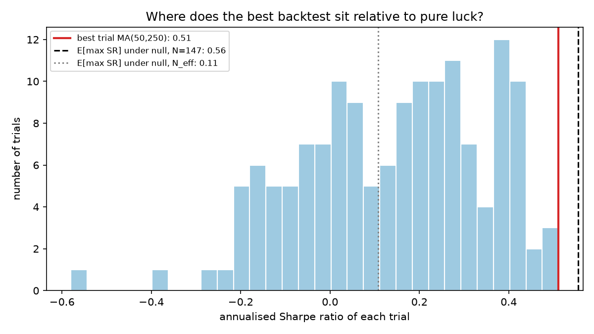
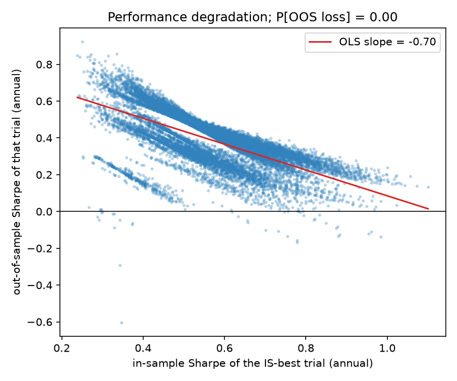
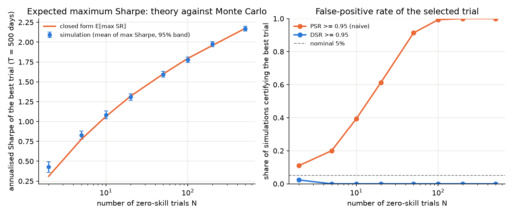
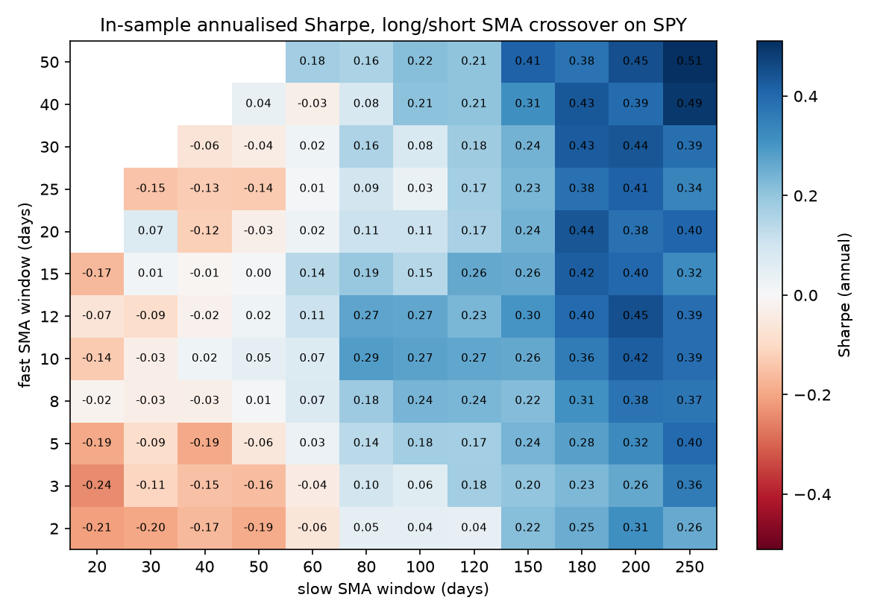
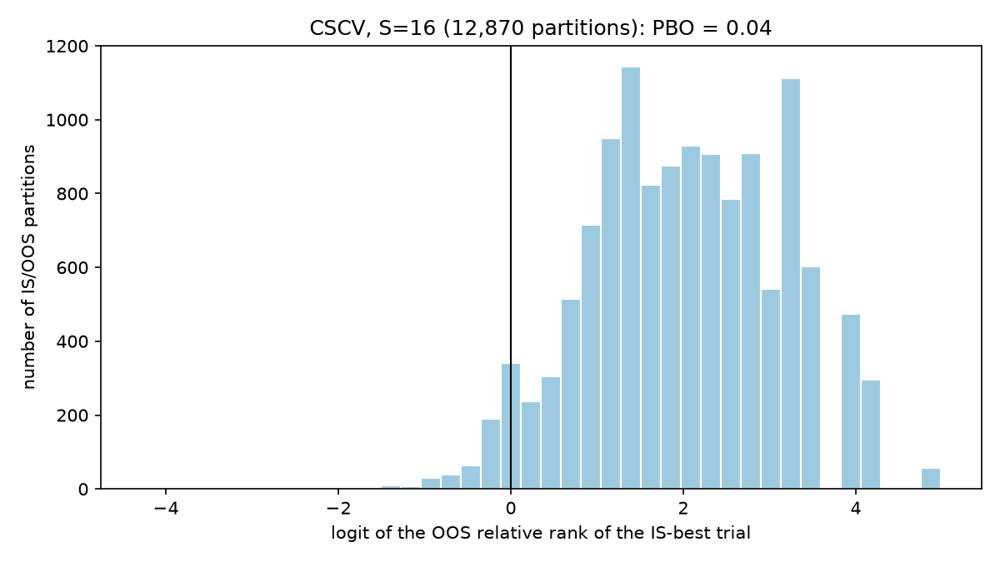

# backtest-overfitting

[](https://github.com/iqueipopg/backtest-overfitting/actions/workflows/tests.yml)
[](LICENSE)

**Is the best backtest in a parameter search real, or just the luckiest of N?**
A small, tested implementation of the selection-bias corrections of Bailey and
López de Prado (probabilistic and deflated Sharpe ratio, minimum track record
and backtest length, probability of backtest overfitting via CSCV), plus the
two things an implementation should ship with and usually does not: a Monte
Carlo check that the formulas hold, and a plain temporal holdout to see whether
the in-sample winner survives. Applied to a 147-trial strategy zoo on five
assets, and usable on any `T x N` matrix of trial returns through
`python -m bto audit`.

**In 90 seconds**

- **The naive test is fooled, the deflated one is not.** On SPY 1996-2026 the
  best of 147 timing rules has an annualised Sharpe of 0.52 and a probabilistic
  Sharpe ratio of 0.998 against zero. The luckiest of 147 zero-skill trials would
  be expected to show 0.49; the deflated Sharpe ratio of the winner is 0.58,
  far from the 0.95 threshold. None of the 147 rules beats buy and hold (0.61).
- **The formulas check out.** In simulation, the closed-form expected maximum
  Sharpe matches the Monte Carlo mean within two standard errors for N from 5
  to 500. With N = 100 noise trials, the naive PSR certifies the best one 99%
  of the time; the DSR never does.
- **Holdout tells the same story, asset by asset.** Selecting the best rule on
  the first 70% of the sample and holding it on the last 30%: on SPY the winner
  stays in the top 1% of trials out of sample, on GLD it lands at the median,
  and on QQQ, EFA and TLT it falls to the 29th, 5th and 19th percentile with a
  negative out-of-sample Sharpe on two of them.
- **Counting trials is the whole game.** The 147 rules are roughly 2.5
  independent bets by participation ratio and 2 clusters by hierarchical
  clustering; against those lenient nulls the DSR is 0.99. The honest answer
  lies between the strict and lenient counts, which is why both are reported
  rather than assumed.

Everything runs offline in under a minute: the price files ship with the repo.
The same API is used as a library by
[iqueipopg/lazy-prices](https://github.com/iqueipopg/lazy-prices) to deflate a
54-variant text-based strategy.

## Results on SPY, daily, 1995-12-29 to 2026-09-18 (7,730 observations)

| | no costs | 5 bp per unit turnover |
|---|---|---|
| Trials (raw N / participation-ratio N / clusters) | 147 / 2.45 / 2 | 147 / 2.45 / 2 |
| Best trial (in-sample) | TSMOM(180) | MA(50,250) |
| Best annual Sharpe | 0.52 | 0.51 |
| Median trial Sharpe | 0.20 | 0.17 |
| Buy-and-hold Sharpe | 0.61 | 0.61 |
| PSR vs. zero (naive) | **0.998** | **0.998** |
| E[max Sharpe] of N noise trials, raw N | 0.49 | 0.56 |
| **DSR, raw N** | **0.58** | **0.40** |
| E[max Sharpe], effective N (participation ratio) | 0.10 | 0.11 |
| DSR, effective N / clusters | 0.99 / 0.99 | 0.99 / 0.99 |
| Min. track record to certify, raw N | 2,281 years | never |
| PBO (CSCV, S = 16, 12,870 partitions) | 0.05 | 0.04 |
| P[out-of-sample loss] | 0.004 | 0.003 |
| OOS-on-IS Sharpe slope (winner) | -0.71 | -0.70 |
| Holdout (70/30, split 2017-06-28): IS winner, IS / OOS Sharpe | TSMOM(180), 0.53 / 0.50 | MA(50,250), 0.53 / 0.49 |
| Holdout: OOS rank of the IS winner among trials | 0.99 | 0.99 |
| Holdout: OOS Sharpe of buy and hold | 0.85 | 0.85 |

What the numbers say:

1. **The naive test is fooled.** Taken on its own, the best trial has a PSR of
   0.998: a 30-year daily Sharpe of 0.52 is "significant" at any conventional
   level.
2. **Deflation kills it.** Once you account for having tried 147
   configurations, the Sharpe you would expect from the luckiest zero-skill
   trial is 0.49 (0.56 with costs). The winner's 0.52 is indistinguishable
   from that: DSR = 0.58. Certifying it against the raw-N null would take
   about 2,300 years of data.
3. **How you count trials decides the verdict.** The 147 trials are variations
   on one idea (trend following on one asset). The participation ratio of
   their correlation matrix says 2.5 independent bets; hierarchical clustering
   on the correlation distance finds 2 clusters, essentially the crossover
   family and the time-series-momentum family. Against either count the DSR
   is 0.99. But selection also happens *inside* a cluster: the winner is the
   luckiest of 133 crossovers or 14 look-backs, not one of two bets. The
   cluster count is a lower bound on the trials, the raw count an upper bound.
4. **PBO is low, and that is consistent, not contradictory.** CSCV asks whether
   the in-sample winner keeps ranking well relative to the other trials out of
   sample. It does (PBO = 0.05): long-lookback trend rules beat short-lookback
   ones in almost every partition, because the zoo has one dominant factor.
   PBO detects overfitting *within* a search; it cannot tell you the whole
   family is unremarkable.
5. **SPY is the exception, not the rule.** The 70/30 holdout keeps the SPY
   winner in the top 1% out of sample with a Sharpe of 0.50. Buy and hold did
   0.85 over the same years. The cross-asset table below shows what the same
   procedure does elsewhere.

<p align="center">
  
  
</p>

## Do the formulas hold? Theory against Monte Carlo

`python -m bto --validate` draws N iid zero-mean trials of 500 observations,
300 times for each N, and compares the mean of the maximum Sharpe with the
closed form, and the share of simulations in which the best trial is
"certified" (probability above 0.95) by the naive PSR and by the DSR
(`results/simulation.csv`).

| N noise trials | E[max Sharpe], simulated (annual) | closed form | PSR false positives | DSR false positives |
|---|---|---|---|---|
| 2 | 0.43 | 0.31 | 11% | 2% |
| 10 | 1.08 | 1.06 | 39% | 0% |
| 50 | 1.59 | 1.60 | 91% | 0% |
| 100 | 1.78 | 1.80 | 99% | 0% |
| 500 | 2.17 | 2.17 | 100% | 0% |

The asymptotic formula understates the maximum at N = 2 by about a third and
is within two standard errors of the simulation from N = 5 on. The PSR of the
selected trial is worthless as a test once more than a handful of
configurations have been tried; the DSR is conservative (its size is below the
nominal 5%), which is the right side to err on.



## Five assets, same zoo

`python -m bto --cross-asset` runs the identical 147-trial zoo on SPY, QQQ,
EFA, TLT and GLD from each one's first available date (`results/cross_asset.csv`).

| Asset | Years | Best trial (full sample) | Best Sharpe | Buy & hold | PSR | DSR raw N | PBO | Holdout IS winner | IS / OOS Sharpe | OOS rank |
|---|---|---|---|---|---|---|---|---|---|---|
| SPY | 30.7 | TSMOM(180) | 0.52 | 0.61 | 0.998 | 0.58 | 0.05 | TSMOM(180) | 0.53 / 0.50 | 0.99 |
| QQQ | 26.5 | MA(50,200) | 0.47 | 0.42 | 0.992 | 0.74 | 0.20 | TSMOM(150) | 0.44 / 0.15 | 0.29 |
| EFA | 24.0 | TSMOM(120) | 0.39 | 0.46 | 0.972 | 0.71 | 0.68 | MA(15,80) | 0.50 / -0.24 | 0.05 |
| TLT | 23.1 | MA(40,60) | 0.44 | 0.30 | 0.983 | 0.72 | 0.37 | MA(30,80) | 0.51 / -0.16 | 0.19 |
| GLD | 20.8 | MA(40,120) | 0.53 | 0.65 | 0.992 | 0.80 | 0.55 | MA(50,150) | 0.48 / 0.52 | 0.55 |

On every asset the naive PSR of the best trial exceeds 0.97 and the DSR stays
below 0.81. In the holdout, the in-sample winner keeps its rank only on SPY;
on QQQ, EFA and TLT it ends below the median trial, twice with a negative
Sharpe. PBO ranges from 0.05 to 0.68, tracking how stable the *relative*
ranking is on each asset rather than whether anything works.

## Audit your own trials

The point of the package is to run these checks on somebody else's backtests.
Put the per-period returns of every variant you tried in a CSV (one column per
trial, first column an index) and run

```bash
python -m bto audit trials.csv --ppy 12      # 12 for monthly, 252 for daily
```

which prints the raw and effective trial counts, the best trial's Sharpe, the
expected maximum under the null, the DSR against raw N, participation-ratio N
and cluster N, PBO and probability of out-of-sample loss, and a 70/30
temporal holdout of the in-sample winner. From Python:

```python
import numpy as np
from bto import audit_trials, build_trials, cscv, deflated_sharpe_ratio, effective_number_of_trials, sharpe_ratio
from bto.data import load_prices

prices = load_prices("SPY")
X, trials = build_trials(prices)                  # T x N DataFrame of daily returns
report = audit_trials(X, periods_per_year=252)    # everything in one dict

sr = np.array([sharpe_ratio(X[c]) for c in X])    # or piece by piece
dsr, sr_star = deflated_sharpe_ratio(sr.max(), sr.var(ddof=1), len(sr), len(X))
pbo = cscv(X.to_numpy(), n_splits=16).pbo
```

## How it works

All Sharpe ratios are computed per period with `T` observations; annualisation
is only for display.

**PSR** (Bailey & López de Prado, 2012). With `γ₃` skewness and `γ₄`
(non-excess) kurtosis of the strategy's returns,

```
PSR(SR*) = Φ[ (SR − SR*) · √(T − 1) / √(1 − γ₃·SR + (γ₄ − 1)/4 · SR²) ]
```

**Expected maximum Sharpe of N noise trials** (Bailey & López de Prado, 2014).
With `V` the variance of the Sharpe estimates across trials and `γ` the
Euler-Mascheroni constant,

```
E[max SR] ≈ √V · [ (1 − γ)·Φ⁻¹(1 − 1/N) + γ·Φ⁻¹(1 − 1/(N·e)) ]
```

**DSR** = PSR of the best trial with `SR* = E[max SR]`. **MinTRL** inverts PSR
for `T`. **MinBTL** (Bailey, Borwein, López de Prado & Zhu, 2014) is the number
of years of backtest needed so that `E[max SR]` of N noise trials stays below a
target annual Sharpe; it is bounded by `2·ln N / SR²`.

**Effective N, two ways.** `effective_number_of_trials` uses the participation
ratio of the eigenvalues of the trial correlation matrix, `(Σλ)² / Σλ²`, which
is N for independent trials and 1 for clones. `cluster_trials` follows the
paper's recommendation: average-linkage hierarchical clustering on the
distance `√((1 − ρ)/2)`, with the number of clusters chosen by the silhouette
score (singletons score zero so that the trivial partition never wins). Both
are reported; both understate selection that happens inside a family.

**CSCV / PBO** (Bailey, Borwein, López de Prado & Zhu, 2017). The `T × N`
return matrix is cut into `S = 16` blocks. For each of the `C(16, 8) = 12,870`
ways to choose 8 blocks as in-sample, the in-sample best trial is selected and
its relative rank `ω` among the N trials out of sample is recorded;
`λ = ln(ω / (1 − ω))` and `PBO = P[λ ≤ 0]`. The implementation only needs
per-block sums and sums of squares, so the full sweep is two matrix products
whatever the length of the sample.

**Holdout.** `holdout` selects the best trial on the first fraction of the
observations and reports that trial's out-of-sample Sharpe, its rank among all
trials out of sample, and its PSR against zero on the out-of-sample period
alone.

**Strategy zoo.** SMA crossovers over a 12 × 12 grid of (fast, slow) windows
with fast < slow (133 trials) plus 14 time-series momentum look-backs.
Positions are +1 / −1 so the equity premium does not flatter every
configuration; signals are lagged one day; all trials are evaluated on the same
dates (warm-up aligned to the longest window); an optional one-way cost per
unit turnover.

<p align="center">
  
  
</p>

## Run it

```bash
pip install -r requirements.txt
pytest -q                              # 26 tests, no network needed
ruff check bto tests                   # lint, also run in CI
python -m bto                          # SPY, no costs: results/summary.json + figures/
python -m bto --cost-bps 5             # with transaction costs
python -m bto --cross-asset --validate # five assets + Monte Carlo check (data cached in data/)
python -m bto --ticker QQQ --refresh   # any yfinance ticker; downloads and caches data/QQQ.csv
python -m bto audit path/to/trials.csv --ppy 12
```

## Tests

`tests/` checks the formulas against closed forms and against the numerical
example in the DSR paper (N = 100, V = 0.5 gives E[max SR] ≈ 1.77); that the
best of 200 pure-noise trials is essentially never certified by the DSR; that
PBO is about 0.5 on noise and near 0 when one trial has genuine skill; that
the closed-form expected maximum matches simulation and the DSR controls its
size; that clustering recovers a planted block structure and never rewards
singletons; that the holdout picks a planted skilled trial and that on noise
the in-sample winner is average out of sample; that strategy signals are
lagged (no look-ahead); that the sums-based CSCV Sharpe matches a direct
computation; and that the audit entry point gives identical output from a
DataFrame and from a CSV.

## Limitations

- One family of signals (trend following). The point is the methodology, not
  the zoo; the cross-asset run shows the methodology, not a strategy.
- Both effective-N estimates count families, not the selection made inside a
  family. Treat the cluster count as a lower bound and raw N as an upper bound.
- Sharpe ratios assume iid returns for annualisation and for the PSR standard
  error. Autocorrelation in strategy returns would widen the bands further.
- The holdout is a single split; CSCV is the systematic version of it.
- Transaction costs are a flat charge per unit turnover; no slippage or
  borrowing cost on the short leg.

## References

- Bailey, D. H. & López de Prado, M. (2012). The Sharpe Ratio Efficient Frontier. *Journal of Risk*, 15(2).
- Bailey, D. H. & López de Prado, M. (2014). The Deflated Sharpe Ratio: Correcting for Selection Bias, Backtest Overfitting and Non-Normality. *Journal of Portfolio Management*, 40(5).
- Bailey, D. H., Borwein, J. M., López de Prado, M. & Zhu, Q. J. (2014). Pseudo-Mathematics and Financial Charlatanism: The Effects of Backtest Overfitting on Out-of-Sample Performance. *Notices of the AMS*, 61(5).
- Bailey, D. H., Borwein, J. M., López de Prado, M. & Zhu, Q. J. (2017). The Probability of Backtest Overfitting. *Journal of Computational Finance*, 20(4).
- Harvey, C. R. & Liu, Y. (2015). Backtesting. *Journal of Portfolio Management*, 42(1).

## License

MIT.
